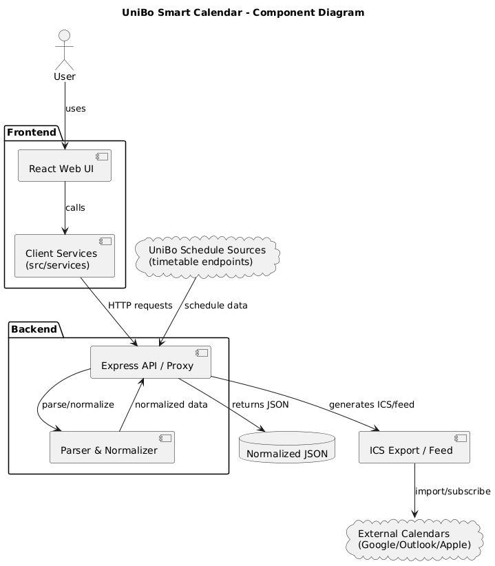
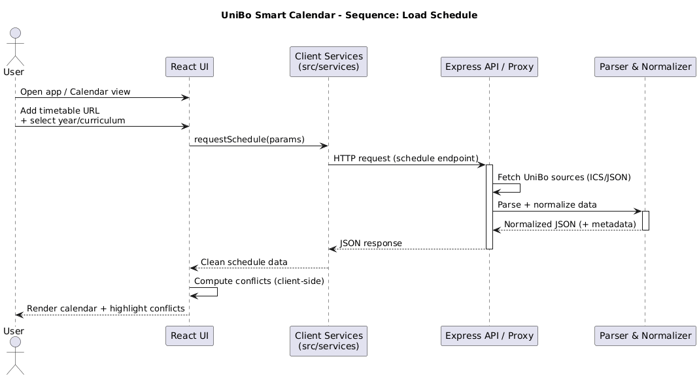
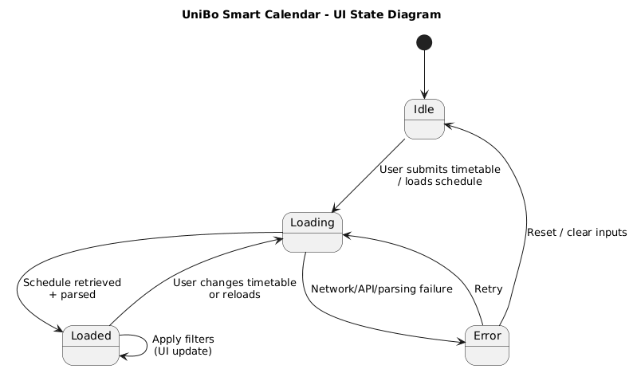

# Design

This chapter explains the strategies adopted to meet the requirements identified in the analysis (Section 02). In particular, it describes the overall architecture of **UniBo Smart Calendar**, how the domain is modeled, how the main interactions are executed, how the UI behaves through well-defined states, and which data-related decisions support parsing, visualization, and interoperability.

## Architecture

UniBo Smart Calendar follows a **layered architecture** implemented in a **monorepo** structure, with a clear separation of concerns between presentation, integration, and data-processing responsibilities. The system is composed of the following main components:

- **Frontend (React GUI):** the user-facing web application. It provides the calendar view, settings pages, and navigation between views. Its responsibility is to render information and collect user inputs (e.g., timetable URL insertion, filter selection, export/subscription actions).
- **Client Services Layer (`src/services`):** a set of modular services used by the UI to communicate with the backend. This layer centralizes HTTP calls and keeps components clean, improving maintainability and enabling easier testing/mocking of interactions.
- **Backend (Node.js / Express API as Proxy):** a web service that intercepts client requests, retrieves the original timetable sources from UniBo endpoints, and exposes the processed output to the frontend. This proxy layer isolates external dependencies and allows schedule retrieval logic to remain centralized.
- **Parser / Normalizer:** processing logic that transforms raw schedule input (e.g., ICS sources) into a normalized JSON representation suitable for the client. The normalizer standardizes event fields and may compute additional metadata needed by the UI.
- **Interoperability endpoints:** functionality for **ICS export** and/or **calendar subscription feed**, enabling synchronization with external calendars (Google Calendar, Outlook, Apple Calendar).

The following component diagram provides a high-level view of how these components are linked:

The architectural choice to route UniBo schedule retrieval through a backend proxy and normalization layer supports key requirements: it reduces duplication in the frontend, improves robustness against changes in external sources, and keeps the UI focused on interaction and visualization.

## Modelling

The domain is modeled around the concept of **academic events** and the academic dimensions needed to build a personalized schedule. The most relevant concepts include:

- **Event:** the core domain entity representing a scheduled item (e.g., lecture) with start/end datetime and metadata (title, location, notes when available).
- **Course / Program / Curriculum / Year:** academic dimensions used to categorize and filter events, enabling personalization.
- **Schedule / Timetable:** a collection of events that can be rendered in the UI and exported/subscribed.
- **Conflict:** a derived concept representing overlapping events according to a clear rule (overlap in time intervals; adjacency is not a conflict).

**DDD-oriented considerations (tactical patterns):** while the project is relatively lightweight and does not include a full domain layer with persistence aggregates, several principles inspired by DDD were applied:
- the domain language (e.g., *Event*, *Conflict*, *Timetable*) is used consistently across the codebase and documentation;
- core domain transformations (normalization and conflict detection) are kept in dedicated modules/utilities to avoid scattering business rules across UI components;
- integration logic is separated from domain rules through the services layer and the backend proxy.

## Interaction

The most relevant interaction in the system is the schedule retrieval flow: the user provides timetable configuration, the system fetches UniBo sources, normalizes the data, and renders the calendar.

At a high level, the interaction can be described as follows:

1. The user navigates to **Calendar Settings** and inserts a timetable URL (and, if required, selects Year/Curriculum).
2. The UI triggers data retrieval via the client services layer.
3. The backend proxy fetches the raw timetable sources from UniBo endpoints.
4. The parser/normalizer transforms the raw input into clean JSON.
5. The frontend receives the normalized dataset and renders it in the calendar view, applying conflict highlighting if required.

This behavior is represented by the following sequence diagram:

## Behaviour

To ensure consistent user feedback and predictable UI behavior, the frontend can be represented as a state machine. The main states are:

- **Idle:** no schedule retrieval is in progress (initial state or after reset).
- **Loading:** the system is retrieving and processing schedule data.
- **Loaded:** the schedule is available and visible in the UI.
- **Error:** retrieval or processing failed; the UI informs the user and supports recovery (retry/reset).

Transitions are triggered by user actions (e.g., submit timetable, change timetable, retry) and by system outcomes (success/failure of retrieval and parsing). The following state diagram summarizes these states and transitions:

## Data-related aspects

The system processes schedule data coming from UniBo sources and provides a normalized representation to the client. The main data aspects are:

- **Input sources:** timetable sources provided by the university (e.g., ICS endpoints or equivalent structured schedule sources).
- **Normalized JSON schema:** the output returned to the frontend is a normalized dataset containing a consistent representation of events (title, start/end datetime, optional metadata). This schema is designed to simplify rendering, filtering, and conflict highlighting.
- **Derived metadata:** conflict flags and any additional computed fields used by the UI to highlight overlaps and improve readability.
- **Interoperability outputs:** the system supports generation of calendar-compatible outputs:
  - **ICS export** for manual import into external calendars
  - **Subscription feed** to keep external calendars synchronized via URL

**Data persistence:** the project does not require a database to function. If caching is enabled, it is treated as a performance optimization (e.g., client-side caching) rather than a persistent storage layer, and does not introduce a separate persistence technology such as MySQL or MongoDB.
